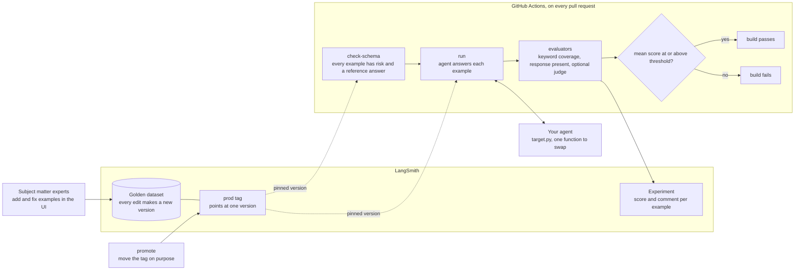
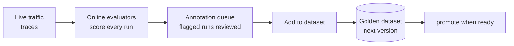

# Agent evals in CI with LangSmith

A small, working example of the pattern. The golden dataset lives in LangSmith, the pipeline pins a version of it, runs the agent against it, and fails the build if the score drops. Three commands, one workflow file, no UI steps in the pipeline.

## The pattern

1. **LangSmith is the source of truth for the dataset.** Subject-matter experts add and correct examples in the UI. Every edit makes a new version automatically.
2. **The pipeline pins a tag, not "latest".** A tag such as `prod` points at one version. CI evaluates against that version until someone moves the tag, so edits in the UI never change a build result by surprise.
3. **CI enforces the dataset schema.** Every example must carry the metadata the team agreed on (here, a `risk` level) and a reference answer. If an example is added without them, the build fails before any agent runs. The required keys are the `REQUIRED_METADATA` tuple at the top of `evals/__main__.py`. Change it to whatever your team agrees, or the check fails on a dataset that has no `risk` key.
4. **The harness lives in the repo and runs through a CLI.** Same commands locally and in CI. The agent is called through one adapter function, so swapping the agent never touches the rest.
5. **Gate on a score.** The run exits non-zero if the gate metric falls below a threshold, which is what makes a GitHub Actions step fail.
6. **Promote on purpose.** When the new examples are ready, move the tag. That is the only moment the pipeline's dataset changes.

Production closes the loop separately: online evaluators score live traffic, flagged runs go to an annotation queue, and reviewed examples are added to the dataset as the next version.

## How it fits together



The dataset only changes for the pipeline when someone runs `promote`. Everything else, including edits in the UI, leaves the build result alone.

Production feeds the next version.



## Commands

```bash
# does every example carry the agreed metadata and a reference answer?
python -m evals check-schema --dataset "agent-golden-set" --tag prod

# run the agent over the pinned dataset version, score it, gate on the mean
python -m evals run --dataset "agent-golden-set" --tag prod --threshold 0.8 --gate-key keyword_coverage

# move the tag to the dataset as it is right now
python -m evals promote --dataset "agent-golden-set" --tag prod
```

`run` prints a summary and, in GitHub Actions, writes it to the job summary with a link to the experiment in LangSmith.

Two things to know before the first run.

- The tag has to exist. A tag that has never been set returns no examples, so run `promote --tag prod` once to create it. After that, only move it on purpose.
- Locally, export the variables from `.env.example` yourself (for example `set -a; source .env; set +a`). Nothing in the harness reads a `.env` file. In GitHub Actions the workflow sets them from secrets.

## Files

| File | What it is |
|---|---|
| `.github/workflows/evals.yml` | The pipeline. Schema check, then the gated run. |
| `evals/__main__.py` | The CLI. `check-schema`, `run`, `promote`. |
| `evals/target.py` | The one function that calls the agent. Swap `AGENT_MODE` for `http` or `agentcore`. |
| `evals/evaluators.py` | Two code evaluators plus an LLM judge that switches on when `OPENAI_API_KEY` is set. |

## Wiring in a real agent

`evals/target.py` has four modes.

- `echo` returns the question. It always fails the gate. Use it to check the pipeline fails properly.
- `reference` returns the reference answer. It always passes. Use it to check the pipeline end to end before the agent is wired in.
- `http` posts the question to `AGENT_URL`. `agentcore` invokes an AgentCore runtime by ARN. Fill in the secrets in the workflow and set `AGENT_MODE`.

The evaluators read `outputs["answer"]`, so whatever the agent returns, put the answer under that key.

## Evaluators

Every evaluator returns a comment alongside the score, so the reason for a failure shows in LangSmith rather than a bare `false`.

- `response_present`. The agent said something.
- `keyword_coverage`. Share of the example's `expected_keywords` found in the answer. Text is normalised first, so unicode hyphens, non-breaking spaces, and markdown do not cause misses.
- `correctness`. An LLM judge from [openevals](https://github.com/langchain-ai/openevals) comparing the answer to the reference. Only built if `OPENAI_API_KEY` is set.

Gate on the code evaluator by default. It is free, deterministic, and cannot have a bad day. Use the judge for the richer signal and compare experiments in the LangSmith UI.

## Secrets the workflow needs

| Secret | Required | Notes |
|---|---|---|
| `LANGSMITH_API_KEY` | yes | A service key for the workspace. |
| `OPENAI_API_KEY` | no | Turns on the LLM judge. |
| `AGENT_RUNTIME_ARN`, AWS credentials | for `agentcore` mode | |

`LANGSMITH_ENDPOINT` is set to the EU endpoint in the workflow.

## References

Where each step of the pattern comes from, and who else runs it this way.

### Docs, by step

| Step | Page | What it says |
|---|---|---|
| Dataset as source of truth | [Evaluation concepts](https://docs.langchain.com/langsmith/evaluation-concepts) | Versions are created automatically when examples change. Tag versions to mark milestones. Target specific versions in CI so dataset updates do not break workflows. |
| Pin a tag | [Manage datasets](https://docs.langchain.com/langsmith/manage-datasets) | Shows tagging a version as `prod` and running tests against it. `list_examples(as_of="prod")` is the documented way to read a tagged version. |
| Pin a tag | [`list_examples`](https://reference.langchain.com/python/langsmith/client/Client/list_examples), [`update_dataset_tag`](https://reference.langchain.com/python/langsmith/client/Client/update_dataset_tag) | SDK reference for reading by tag and moving a tag. |
| Edit examples in the UI | [Manage datasets in the application](https://docs.langchain.com/langsmith/manage-datasets-in-application) | Adding runs to a dataset, editing examples and their metadata in the UI. |
| Run and score | [Evaluate an LLM application](https://docs.langchain.com/langsmith/evaluate-llm-application), [Evaluation quickstart](https://docs.langchain.com/langsmith/evaluation-quickstart) | `evaluate()` with a target function, a dataset or an iterator of examples, evaluators, and experiment metadata. |
| Evaluators | [openevals](https://github.com/langchain-ai/openevals), [Run evals with openevals](https://docs.langchain.com/langsmith/openevals) | Ready-made LLM-as-judge and code evaluators that drop straight into `evaluate()`. |
| CI | [Pytest integration](https://docs.langchain.com/langsmith/pytest), [Vitest and Jest](https://docs.langchain.com/langsmith/vitest-jest) | The test-framework route. Each test becomes a dataset example and each run an experiment. Advice on caching LLM calls in CI and setting experiment metadata from env vars. The pytest page says to move to `evaluate()` as the example list grows, which is what this repo does. |
| CI | [CI/CD pipeline example](https://docs.langchain.com/langsmith/cicd-pipeline-example), [repo](https://github.com/langchain-ai/cicd-pipeline-example) | The official end-to-end GitHub Actions example. Offline evals with openevals run on every pull request, then preview and production deploys. Larger than this repo, same idea. |
| Compare to a baseline | [Compare experiment results](https://docs.langchain.com/langsmith/compare-experiment-results) | Pick a source experiment, see per-example regressions and improvements in the UI. |
| Production loop | [Online evaluations](https://docs.langchain.com/langsmith/online-evaluations-llm-as-judge), [Annotation queues](https://docs.langchain.com/langsmith/annotation-queues), [Automation rules](https://docs.langchain.com/langsmith/rules) | Score live traffic with sampling, route flagged runs to a queue, correct them, and add them to the dataset as the next version. |

The score gate in this repo, a mean per evaluator checked against a threshold with a non-zero exit, is harness code rather than a documented SDK feature. The docs route to a failing build is assertions in the pytest or vitest integrations. Either works; this repo uses the gate so the threshold is a flag, not a code change.

### Case studies

Public write-ups on langchain.com that describe the same loop.

- [monday.com](https://www.langchain.com/blog/customers-monday). Test suites as datasets, an eval command that runs in the CI pipeline, every CI run logged as a separate experiment, online LLM-as-judge on sampled traffic.
- [Rippling](https://www.langchain.com/blog/how-rippling-went-ai-native-across-every-product-in-6-months-with-deep-agents-and-langsmith). Layered evals. Cheap checks on every commit, a larger set after merge, a small deploy-blocking set that gates every release, scheduled evals on production data.
- [ServiceNow](https://www.langchain.com/blog/customers-servicenow). Golden datasets built from successful runs to prevent regression, production runs above a score threshold added to the dataset automatically.
- [Madrigal](https://www.langchain.com/blog/customers-madrigal). Production failures feed back into datasets, every meaningful error becomes a new test case, deploys through GitHub CI.
- [Podium](https://www.langchain.com/blog/customers-podium). Baseline dataset with edge cases added over time for regression testing, plus online evaluation.
